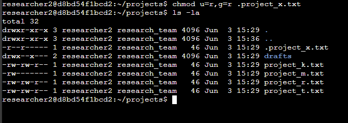

# File permissions in Linux

## Project description

The research team at the organization needs to update the file permissions for the files and directories within the `projects` directory. The current state doesn't reflect the real level of authorizations. Checking and updating permissions will help to have a secure system.

## Check file and directory details

Check the contents and permissions of the `projects` directory.

The `ls` command allows us to displays all the files and subdirectories inside a directory. This command, with the option `-l`, displays the files and subdirectories with their given permissions.

The permissions for all owner types are represented with a 10-character string, like `drwxrwxrwx`.

- The 1st character indicates the file type, `d` for directory and `-` for a regular file.

- The rest of the characters are divided in three 3-string segments, each segment represent the permissions for the user, group, and other, in that order.

- The first character of a 3-string segment represents the reading  (`r`) permissions, the second the writing (`w`) permissions, and the third for execution (`x`) permissions. If a permission is not granted, then a hyphen (`-`) replaces the corresponding letter (`r`, `w`, or `x`).

## Change file permissions

None of the files should allow the other users to write files.

Used `chmod` to change the permissions for `project_k.txt`, to set the permissions so that the other users can't write on the file.

Used `chmod` to change the permissions for `project_m.txt`, to set the permissions so that only the owner is able to read or write on the file.

`chmod` allows to change the permissions for the file. It expects the new representation of the permissions, and the name of the file to modify as a parameter.

- `u` represents the user, `g` represents group, and `o` represents other.

- `+` adds permissions, `-` removes permission, `=` sets the permissions exactly as they were passed.

- `r` read permissions, `w` write permissions, `x` execute permissions.

The combination of the previous characters allows us to modify permissions for a file. For example, `chmod g+w, o-r example.txt`; this example will add write permissions to the group and remove read permissions from other users.

## Change file permissions on a hidden file

Determine if a hidden file has the correct permissions and change them if needed.

The file .project_x.txt is a hidden file that has been archived and should not be written to by anyone. (The user and group should still be able to read this file.)

`ls -a` allows us to display all the files and subdirectories in a directory, including hidden files.

To set user and group permissions to read only, I used the `chmod` command like `chmod u=r,g=r .project_x.txt`. This command sets the user and group permissions exactly to `r` only. If the other users had had permissions, we could've added the following option `o=---`, this option would set all the permissions for other users to none.

## Change directory permissions

Change the permissions of a directory.

Only the `researcher2` user should be allowed to access the drafts directory and its contents. (This means that only `researcher2` should have execute privileges.)

`chmod g=-` allows us to set all the group permissions for the `drafts` directory to none.

## Summary

I changed the permissions to match the expected level of authorization for the necessary files.